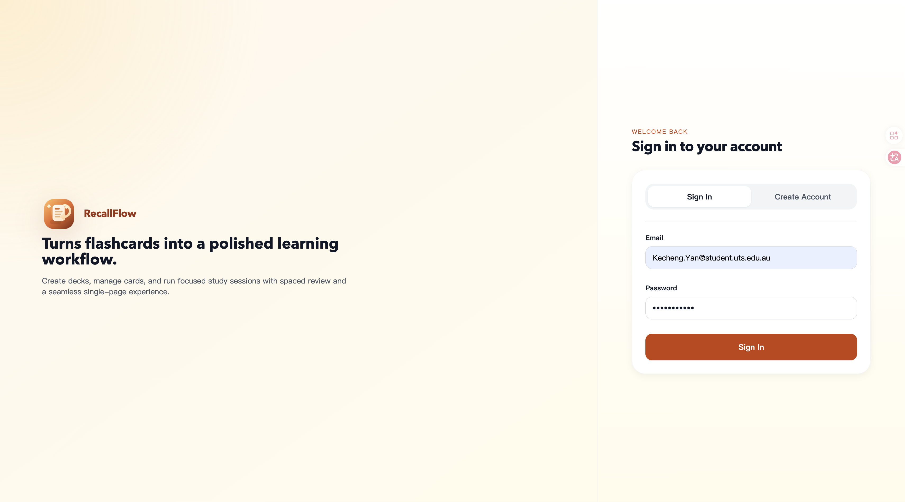
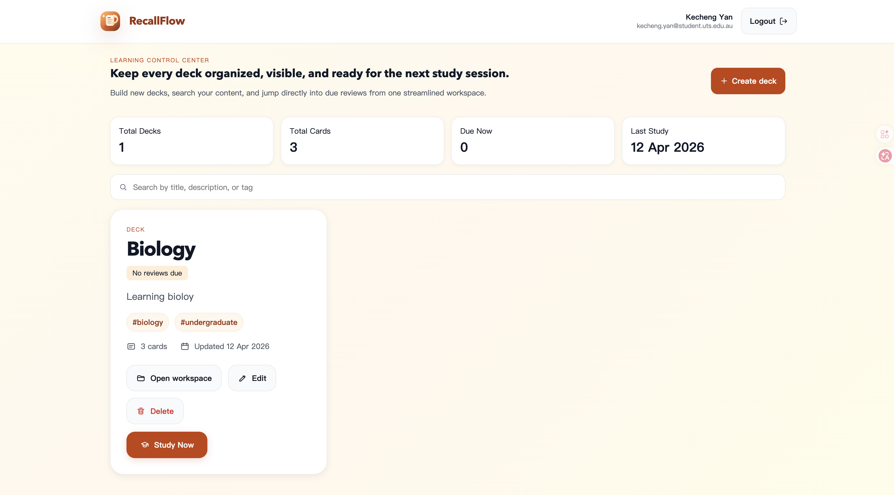
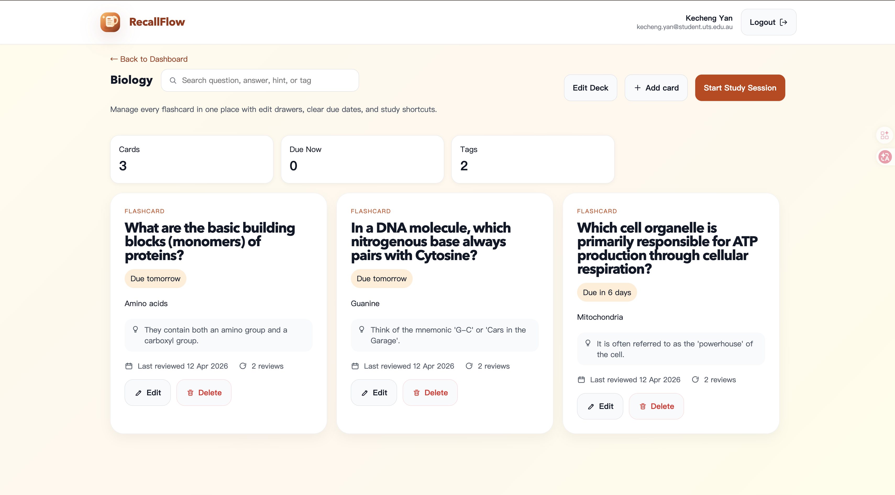
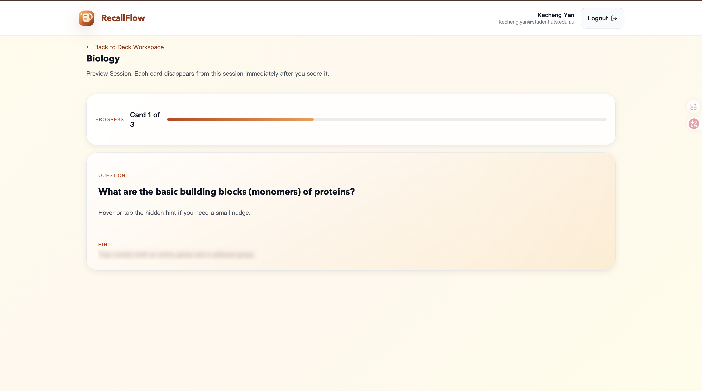

# RecallFlow

RecallFlow is a single-page flashcard learning app built for the Dynamic Web Interface to a Database System assignment. It helps students create decks, manage flashcards, and run focused study sessions where each card flips to reveal the answer and disappears from the session after it is scored.

## About Database Files

This project is using MongoDB Atlas, which is a DBaaS, I downloaded the collections in `database_JSON/`

## Problem It Solves

RecallFlow keeps the full learning workflow in one polished SPA so users can create decks, edit cards, review due content, and see progress without disruptive page reloads.

## Technical Stack

- Frontend: React, Vite, React Router, React Query, React Hook Form, Zod
- Styling: Custom CSS with responsive layout, animated surfaces, modals, and drawers
- Backend: Node.js, Express
- Data: MongoDB Atlas with Mongoose models for users, decks, cards, and review events
- Authentication: JWT stored in secure HTTP-only cookies
- Testing: Vitest for backend utility coverage
- Deployment: Ready for local development; can be deployed later with separate frontend/backend hosting

## Feature List

- Single-page application shell with client-side routing only
- Register, login, logout, and protected user workspaces
- Create, read, update, and delete decks
- Create, read, update, and delete flashcards
- Searchable dashboard with deck metrics and due-card visibility
- Study mode with card flip interaction and post-review removal from the active session
- Lightweight spaced repetition fields: `ease`, `streak`, `reviewCount`, `lastReviewedAt`, `nextReviewAt`
- Responsive design for desktop and mobile
- Loading states, empty states, and API error feedback
- Keyboard-friendly forms and accessible dialog structure

## Folder Structure

```text
.
├── client
│   ├── src
│   │   ├── app
│   │   ├── components
│   │   ├── features
│   │   ├── layouts
│   │   ├── pages
│   │   ├── services
│   │   ├── styles
│   │   └── utils
├── server
│   ├── src
│   │   ├── config
│   │   ├── controllers
│   │   ├── middleware
│   │   ├── models
│   │   ├── routes
│   │   └── utils
│   └── tests
└── README.md
```

## API Overview

- `POST /api/auth/register`
- `POST /api/auth/login`
- `POST /api/auth/logout`
- `GET /api/auth/me`
- `GET /api/decks`
- `POST /api/decks`
- `PATCH /api/decks/:id`
- `DELETE /api/decks/:id`
- `GET /api/decks/:deckId/cards`
- `POST /api/decks/:deckId/cards`
- `PATCH /api/cards/:id`
- `DELETE /api/cards/:id`
- `GET /api/study/decks/:deckId/session`
- `POST /api/study/cards/:id/review`

## Running The Project

1. Install dependencies:

   ```bash
   npm install
   ```

2. Copy environment templates:

   ```bash
   cp server/.env.example server/.env
   cp client/.env.example client/.env
   ```

3. Update `server/.env` with your MongoDB Atlas connection string and a custom `JWT_SECRET`.

4. Start the full app:

   ```bash
   npm run dev
   ```

5. Open [http://localhost:5173](http://localhost:5173). The API runs on [http://localhost:5050](http://localhost:5050).

## Screenshots







